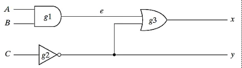
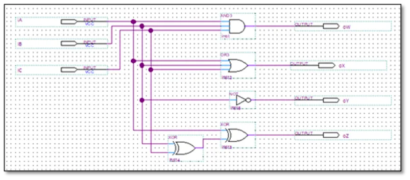
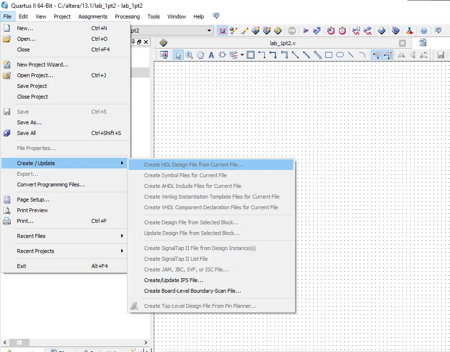
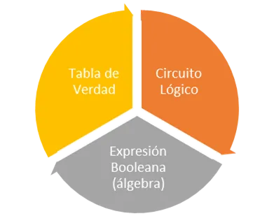
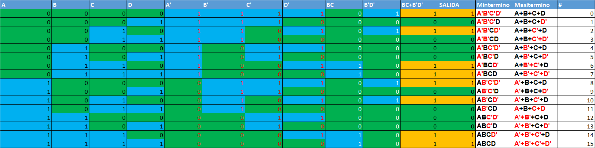
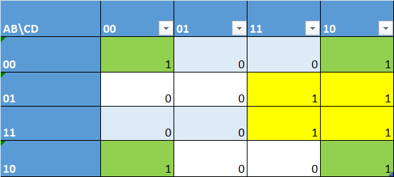

# EJERCICIOS
## Ejercicio 1
### Compuertas  booleanas básicas de tres entradas  con descripción en operadores lógicos
```verilog
module Compuertas(iA,iB,iC,oW,oX,oY,oZ); 
input iA,iB,iC; 
output oW,oX,oY,oZ; 

assign oW = iA&iB&iC;		  //Compuerta AND 3-In 
assign oW = ~(iA&iB&iC);	//Compuerta NAND 3-In 
assign oX = iA|iB|iC;			//Compuerta OR 3-In 
assign oX = ~(iA|iB|iC);	//Compuerta NOR 3-In 
assign oY = ~iB;			    //Compuerta NOT 
assign oY = ~iA;			    //Compuerta NOT 
assign oZ = iA^iB^iC;			//Compuerta OREX 3-In 
assign oZ = ~(iA^iB^iC);	//Compuerta NOREX 3-In 

endmodule
```
En este ejercicio se pudo observar cómo, a través del uso de operadores lógicos en Verilog, es posible describir compuertas booleanas de tres entradas. La práctica permitió identificar la manera en que cada operación se traduce directamente en una compuerta lógica, mostrando la relación entre el álgebra booleana y el código HDL.    

## Ejercicio 2
### Expresión booleana usando operadores lógicos

#### Implementar el circuito de la figura 1, usando la definición de compuertas dada en el ejercicio 1.


```verilog
module circuito_uno(iA,iB,iC,oX,oY); // Se definen las entradas y salidas
input iA,iB,iC;                        
output oX,oY; 
wire e;

																		 // Para expresiones booleanas se escriben las salidas en términos de las entradas
                                                            
assign oX = (iA & iB) | ~iC);

 // Vemos que oX es la suma (|) de la señal iC negada (~iC) con la multiplicación (&) de las señales iA e iB

assign oY = ~iC;                    
 // La salida oY es simplemente la negación de iC (~iC)

endmodule

```
### Retroalimentación  

Se pudo observar cómo se representa el circuito en forma de código Verilog (.v), mostrando la relación entre las entradas y salidas mediante expresiones booleanas.      

## Ejercicio 3
#### En el siguiente ejemplo HDL, se muestra la descripción de un circuito que se especifica las siguientes dos expresiones booleanas:
x = A + BC + B'D

y = B'C + BC'D

```verilog
module circuito_dos (iA,iB,iC,iD,oX,oY); 
input iA,iB,iC,iD; // Ya que X y Y se escriben en términos de A, B, C y D; X y Y serán 
output oX,oY;      // las salidas, y A, B, C y D serán las entradas.

assign oX = iA | (iB & iC) | (~iB & iD);		// x = A+ BC+B'D 
assign oY = (~iB & iC) | (iB & ~iC & ~iD);	//y = B'C+BC'D' 

endmodule 
```
Se pudo observar cómo a partir de expresiones booleanas se describe el comportamiento de un circuito en Verilog (.v), asignando de manera directa las operaciones lógicas a las salidas en función de las entradas.     

## Ejercicio 4 
### Compuertas  booleanas básicas de tres entradas  con descripción en primitivas

```verilog
module Compuertas(iA,iB,iC,oW,oX,oY,oZ); 
input iA,iB,iC; 
output oW,oX,oY,oZ; 

and g1(oW,iA,iB,iC);		//Compuerta AND 3-In 
nand g2(oW,iA,iB,iC);		//Compuerta NAND 3-In 
or g3(oX,iA,iB,iC);			//Compuerta OR 3-In 
nor g4(oX,iA,iB,iC);		//Compuerta NOR 3-In 
not g5(oY,iA);				  //Compuerta NOT 
not g6(oY,iB);			    //Compuerta NOT 
not g7(oY,iC);			    //Compuerta NOT 
xor g8(oZ,iA,iB,iC);		//Compuerta OREX 3-In 
xnor g9(oZ,iA,iB,iC);		//Compuerta NOREX 3-In 

endmodule
```
Se pudo observar cómo se describen compuertas lógicas básicas de tres entradas utilizando primitivas en Verilog, lo que permite representar directamente el funcionamiento de cada compuerta en el código.    

## Ejercicio 5
Vamos a escribir el código correspondiente a la figura presentada a continuación.    


El módulo en este caso será el conjunto de las tres compuertas lógicas, que como podemos ver tiene 3 entradas y 2 salidas.   

```verilog

//Descripción del circuito ilustrado en la Figura 1-3 

module ejercicio_uno(iA,iB,iC,oX,oY); 
		// Vemos que las entradas A,B y C, se definen con el índice "i" (in)
		// y las salidas tienen el índice "o" (out)

input iA,iB,iC;
		// iA, iB e iC se declaran como entradas del módulo 

output oX,oY;
		// Y oX y oY se declaran como salidas 

wire e;
		// Las conexiones internas se declaran como alambres (wire) 

and g1(e,iA,iB);
		// De la imagen observamos que la salida de la compuerta AND 
		// es "e" y las entradas son iA e iB

not g2(oY,iC);
		// La compuerta NOT solo cuenta con una entrada (iC) y una salida (oY) 

or g3(oX,e,oY);
		// Una de las entradas de la compuerta OR es la saldia de la compuerta AND "e"
		// la otra entrada es oY y su salida es oX

// En nombre dado a las compuertas es arbitrario, su única propósito es ayudar a tener
// un código más ordenado
endmodule 

```
Se pudo observar cómo se representa el circuito mediante primitivas en Verilog, identificando la relación entre el diagrama lógico y su descripción en código. Esto permitió ver claramente cómo las compuertas AND, NOT y OR se combinan para obtener las salidas correspondientes.    

## Ejercicio 6 
### Compuertas  booleanas básicas de tres entradas  con descripción en operadores condicionales

```verilog
module Compuertas(iA,iB,iC,oW,oX,oY,oZ); 
input iA,iB,iC; 
output oW,oX,oY,oZ; 

//Compuerta AND 3-In 
assign oW = ((iA==1'b1) && (iB==1'b1) && (iC==1'b1)) ? 1'b1 : 1'b0;	

//Compuerta OR 3-In 
assign oX = ((iA==1'b0) && (iB==1'b0) && (iC==1'b0)) ? 1'b0 : 1'b1;

//Compuerta NOT		 
assign oY = (iA == 1'b0) ? 1'b1 : 1'b0; 

//Compuerta XOR 2-In 
assign oZ = ((iA==1'b0) && (iB==1'b1)) ? 1'b1 : (((iA==1'b1) && 	(iB==1'b0)) ? 1'b1: 1'b0); 

endmodule 
```
Se pudo observar cómo es posible describir compuertas lógicas utilizando operadores condicionales en Verilog, lo cual permite expresar de manera explícita las condiciones bajo las que cada salida toma el valor de 1 o 0.    

## Ejercicio 7 
### Compuertas  booleanas básicas de tres entradas  con descripción en primitivas definidas por el usuario

```verilog
module Compuertas(oW,oX,oY,oZ,iA,iB,iC); 
input iA,iB,iC; 
output oW,oX,oY,oZ; 
 
MiAND(oW,iA,iB,iC);			//Compuerta AND 3-In 
MiOR(oX,iA,iB,iC);			//Compuerta OR 3-In 
MiNOT(oY,iB);				//Compuerta NOT 
MiOREX(oZ,iA,iB,iC);			//Compuerta OREX 3-In 

endmodule 
//
primitive MiOREX(X,A,B,C); 
output X; 
input A,B,C; 
table 
  //A B C : X			//Tabla de verdad 
    0 0 0 : 0;			//m0 
    0 0 1 : 1; 			//m1 
    0 1 0 : 1; 			//m2 
    0 1 1 : 0; 			//m3 
    1 0 0 : 1; 			//m4 
    1 0 1 : 0; 			//m5 
    1 1 0 : 0; 			//m6 
    1 1 1 : 1; 			//m7 
endtable 

endprimitive 
//
primitive MiAND(X,A,B,C); 

output X; 
input  A,B,C; 
table		 

  //A B C : X			//Tabla de verdad 
    0 0 0 : 0;			//m0 
    0 0 1 : 0; 			//m1 
    0 1 0 : 0; 			//m2 
    0 1 1 : 0; 			//m3 
    1 0 0 : 0; 			//m4 
    1 0 1 : 0; 			//m5 
    1 1 0 : 0; 			//m6 
    1 1 1 : 1; 			//m7 
endtable 

endprimitive 
// 
primitive MiOR(X,A,B,C); 
output X; 
input  A,B,C; 
table		 

  //A B C : X			//Tabla de verdad 
    0 0 0 : 0;			//m0 
    0 0 1 : 1; 			//m1 
    0 1 0 : 1; 			//m2 
    0 1 1 : 1; 			//m3 
    1 0 0 : 1; 			//m4 
    1 0 1 : 1; 			//m5 
    1 1 0 : 1; 			//m6 
    1 1 1 : 1; 			//m7 
endtable 

endprimitive 
//
primitive MiNOT(X,A); 
output X; 
input  A; 
table		 

  //A : X			//Tabla de verdad 
    0 : 1;			//m0 
    1 : 0; 			//m1 
endtable 

endprimitive
```

## Ejercicio 8
### Herramientas de edición de esquemático de Quartus
En un proyecto de Quartus, crea un circuito lógico esquemático (Squematic File) en vez de un archivo Verilog HDL (Verilog HDL File). A continuación, y con ayuda de las herramientas de edición de esquemático propias de Quartus, implementa el circuito ilustrado en la figura 2.    



Procede a obtener la nueva descripción Verilog usando el comando “Create HDL File from Current File”, el cual se ubica en el menú ‘File\Create\Update’. Ver Figura 3.     

Posteriormente, procede a compilar y a simular e implementar en tu tarjeta de entrenamiento.    


Hciendo esto el codigo verilog al que sellega es este:     


```verilog
// Copyright (C) 1991-2013 Altera Corporation
// Your use of Altera Corporation's design tools, logic functions 
// and other software and tools, and its AMPP partner logic 
// functions, and any output files from any of the foregoing 
// (including device programming or simulation files), and any 
// associated documentation or information are expressly subject 
// to the terms and conditions of the Altera Program License 
// Subscription Agreement, Altera MegaCore Function License 
// Agreement, or other applicable license agreement, including, 
// without limitation, that your use is for the sole purpose of 
// programming logic devices manufactured by Altera and sold by 
// Altera or its authorized distributors.  Please refer to the 
// applicable agreement for further details.


// Generated by Quartus II 64-Bit Version 13.1 (Build Build 162 10/23/2013)
// Created on Wed Sep 10 19:51:49 2025

esquematico esquematico_inst
(
	.A(A_sig) ,	// input  A_sig
	.B(B_sig) ,	// input  B_sig
	.C(C_sig) ,	// input  C_sig
	.oW(oW_sig) ,	// output  oW_sig
	.oX(oX_sig) ,	// output  oX_sig
	.oY(oY_sig) ,	// output  oY_sig
	.oZ(oZ_sig) 	// output  oZ_sig
);
```
En este ejercicio se pudo observar cómo, a partir del uso de las herramientas de edición esquemática de Quartus, es posible diseñar un circuito de manera gráfica y luego generar automáticamente su descripción en Verilog. Esto facilita la transición entre la representación visual y el código HDL, reforzando la relación entre ambas formas de diseño.     

## Ejercicio 9
### Expresiones Booleanas Básicas
Recordemos que hay tres formas de representar un mismo circuito lógico     

- A partir de su expresión lógica booleana, en cualquiera de sus formas: canónica, normalizada o simplificada     
- Tabla de verdad, donde se lista la salida para todas combinaciones de entrada    
- Esquemático, desarrollado a partir de las compuertas básicas.     


Para el desarrollo de esta actividad, ten presente: 


💡 Toma como punto de partida la función lógica asignada para desarrollar el componente práctico del primer parcial.     


1. Toma la función canónica y la función simplificada. Realiza la descripción HDL del circuito digital para ambas funciones utilizando el lenguaje Verilog así:      
    1. Utilizando primitivas del sistema; es decir, a partir de las palabras claves and, nand, or, nor, not, xor y xnor.     
    2. Usando operadores lógicos a bit: ~, &, |, ^    
        
        NOTA: Para las descripciones anteriores puede ayudarse con la palabra reservada wire, la cual te permite definir variables internas o ‘alambre’ en cada uno de los minitérminos o maxitérminos o según necesidad.    
        
    3. Usando primitivas definidas por el usuario (UDP), apoyándose en la tabla de verdad.
    4. Usando esquemático RTL propio de Quartus.   
2. Propón la simulación, tomando cuatro de las alternativas cualesquiera del total de las condiciones de entradas definidas en su tabla de verdad. Tome un pantallazo que ilustre los valores de las entradas y el valor de salida en cada uno de las soluciones, de tal manera que se muestre el mismo comportamiento final efectivo.   
3. A continuación, implemente utilizando la tarjeta de entrenamiento su circuito digital y valide el funcionamiento para todas las funciones.   

La ecuacion asignada en el primer parcial practico fue:    
     
**y=∑(0,2,6,7,8,10,14,15)**
   
Realizando las simplificacion con mapa de mapa de karnaugh y tablas de verdad se llego a esto:

            
Tabla de verdad 

| A | B | C | D | A' | B' | C' | D' | BC | B'D' | BC+B'D' | SALIDA | Mintermino | Maxitermino | #  |
|---|---|---|---|----|----|----|----|----|------|---------|--------|------------|-------------|----|
| 0 | 0 | 0 | 0 | 1  | 1  | 1  | 1  | 0  | 1    | 1       | 1      | A'B'C'D'   | A+B+C+D     | 0  |
| 0 | 0 | 0 | 1 | 1  | 1  | 1  | 0  | 0  | 0    | 0       | 0      | A'B'C'D    | A+B+C+D'    | 1  |
| 0 | 0 | 1 | 0 | 1  | 1  | 0  | 1  | 0  | 1    | 1       | 1      | A'B'CD'    | A+B+C'+D    | 2  |
| 0 | 0 | 1 | 1 | 1  | 1  | 0  | 0  | 0  | 0    | 0       | 0      | A'B'CD     | A+B+C'+D'   | 3  |
| 0 | 1 | 0 | 0 | 1  | 0  | 1  | 1  | 0  | 0    | 0       | 0      | A'BC'D'    | A+B'+C+D    | 4  |
| 0 | 1 | 0 | 1 | 1  | 0  | 1  | 0  | 0  | 0    | 0       | 0      | A'BC'D     | A+B'+C+D'   | 5  |
| 0 | 1 | 1 | 0 | 1  | 0  | 0  | 1  | 1  | 0    | 1       | 1      | A'BCD'     | A+B'+C'+D   | 6  |
| 0 | 1 | 1 | 1 | 1  | 0  | 0  | 0  | 1  | 0    | 1       | 1      | A'BCD      | A+B'+C'+D'  | 7  |
| 1 | 0 | 0 | 0 | 0  | 1  | 1  | 1  | 0  | 1    | 1       | 1      | AB'C'D'    | A'+B+C+D    | 8  |
| 1 | 0 | 0 | 1 | 0  | 1  | 1  | 0  | 0  | 0    | 0       | 0      | AB'C'D     | A'+B+C+D'   | 9  |
| 1 | 0 | 1 | 0 | 0  | 1  | 0  | 1  | 0  | 1    | 1       | 1      | AB'CD'     | A'+B+C'+D   | 10 |
| 1 | 0 | 1 | 1 | 0  | 1  | 0  | 0  | 0  | 0    | 0       | 0      | AB'CD      | A+B+C+D     | 11 |
| 1 | 1 | 0 | 0 | 0  | 0  | 1  | 1  | 0  | 0    | 0       | 0      | ABC'D'     | A'+B'+C+D   | 12 |
| 1 | 1 | 0 | 1 | 0  | 0  | 1  | 0  | 0  | 0    | 0       | 0      | ABC'D      | A'+B'+C+D'  | 13 |
| 1 | 1 | 1 | 0 | 0  | 0  | 0  | 1  | 1  | 0    | 1       | 1      | ABCD'      | A'+B'+C'+D  | 14 |
| 1 | 1 | 1 | 1 | 0  | 0  | 0  | 0  | 1  | 0    | 1       | 1      | ABCD       | A'+B'+C'+D' | 15 |

                      

Mapa de karnaugh

| AB\CD | 00 | 01 | 11 | 10 |
|-------|----|----|----|----|
| 00    |  1 |  0 |  0 |  1 |
| 01    |  0 |  0 |  1 |  1 |
| 11    |  0 |  0 |  1 |  1 |
| 10    |  1 |  0 |  0 |  1 |

De esta simplificacion la funcion obtenida fue:    
**y=BC+B'D'**
